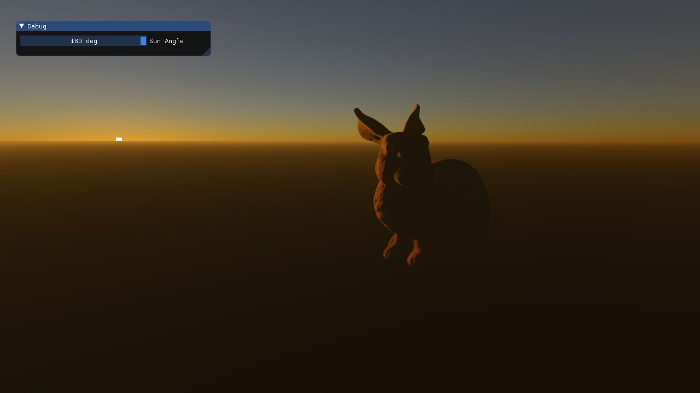
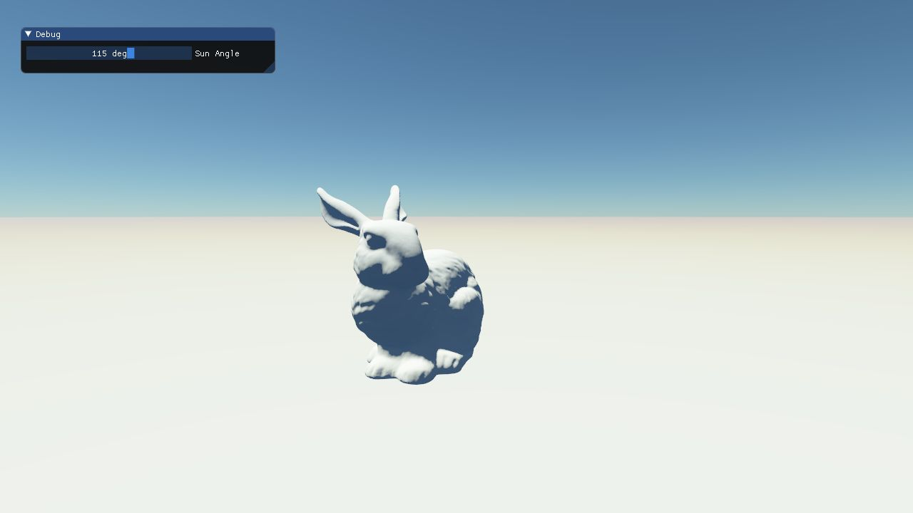
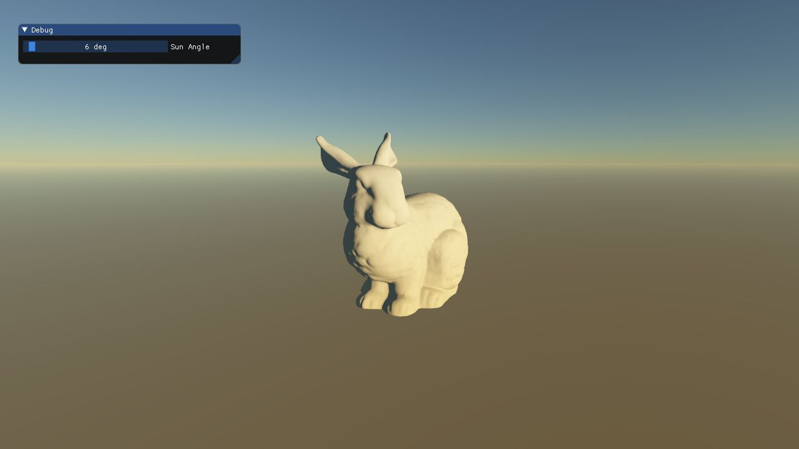

# AtmosphericScattering
A compute shader based implementation of Eric Brunetons' recently updated Atmospheric Scattering implementation with a practical rasterization-based demo instead of the ray-tracing demo provided with Erics' own repository.

The compute shader implementation of the precomputation step is a direct OpenGL and GLSL port of the [Unity implementation](https://github.com/Scrawk/Brunetons-Improved-Atmospheric-Scattering) by Scrawk.

## Demo
Please check the Releases section for the demo binary along with the assets. Just extract it and run the executable!

## Screenshots





## References
* [Brunetons-Improved-Atmospheric-Scattering](https://github.com/Scrawk/Brunetons-Improved-Atmospheric-Scattering)
* [precomputed_atmospheric_scattering](https://github.com/ebruneton/precomputed_atmospheric_scattering)

## Dependencies
* [dwSampleFramework](https://github.com/diharaw/dwSampleFramework) 

## License
```
Copyright (c) 2018 Dihara Wijetunga

Permission is hereby granted, free of charge, to any person obtaining a copy of this software and 
associated documentation files (the "Software"), to deal in the Software without restriction, 
including without limitation the rights to use, copy, modify, merge, publish, distribute, sublicense,
and/or sell copies of the Software, and to permit persons to whom the Software is furnished to do so, 
subject to the following conditions:

The above copyright notice and this permission notice shall be included in all copies or substantial
portions of the Software.

THE SOFTWARE IS PROVIDED "AS IS", WITHOUT WARRANTY OF ANY KIND, EXPRESS OR IMPLIED, INCLUDING BUT NOT 
LIMITED TO THE WARRANTIES OF MERCHANTABILITY, FITNESS FOR A PARTICULAR PURPOSE AND NONINFRINGEMENT. 
IN NO EVENT SHALL THE AUTHORS OR COPYRIGHT HOLDERS BE LIABLE FOR ANY CLAIM, DAMAGES OR OTHER LIABILITY,
WHETHER IN AN ACTION OF CONTRACT, TORT OR OTHERWISE, ARISING FROM, OUT OF OR IN CONNECTION WITH THE 
SOFTWARE OR THE USE OR OTHER DEALINGS IN THE SOFTWARE.
```
